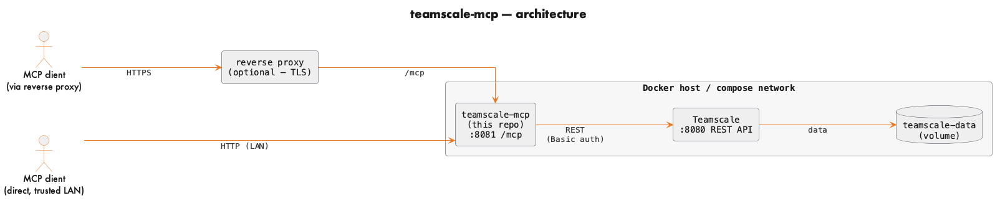
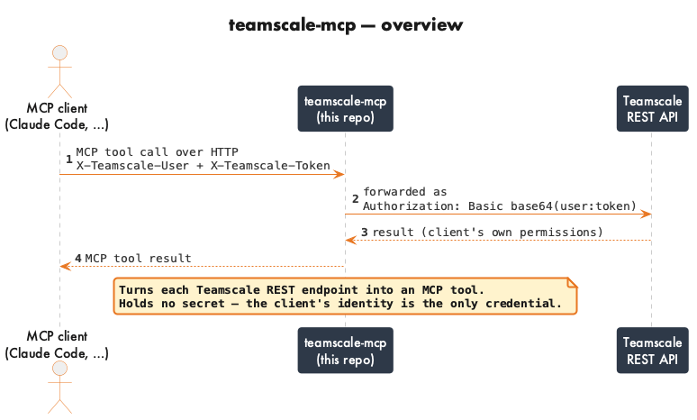
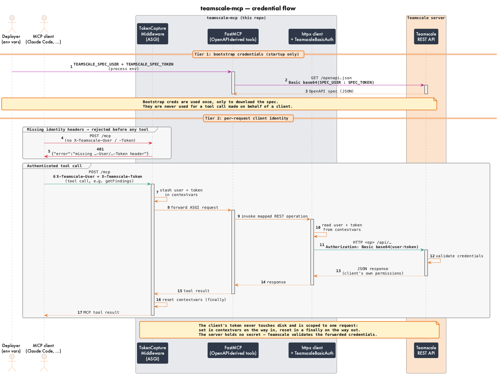

<h1 align="center"><a href="https://gitlab.com/cqse/internal/teamscale-mcp">Teamscale REST API MCP server</a></h1>

<p align="center"><em>MCP server that exposes the Teamscale REST API as tools, running as a container sidecar with per-client credential pass-through.</em></p>

A standalone [MCP](https://modelcontextprotocol.io) server that exposes the
[Teamscale](https://teamscale.com) REST API as MCP tools. It runs as a **container
sidecar** next to your Teamscale instance: at startup it downloads the instance's
**live** OpenAPI spec (`GET {TEAMSCALE_SERVER_URL}/openapi.json`) and turns every
documented operation into an MCP tool via `FastMCP.from_openapi` (**123 tools** with
`TEAMSCALE_INCLUDE_INTERNAL=false` against a 2026.4 instance — the exact count tracks
whatever your instance's spec exposes), served over streamable **HTTP** so any MCP
client connects to it by URL.

> **Related:** [**teamscale-docs-mcp**](https://gitlab.com/cqse/internal/teamscale-docs-mcp)
> is the companion server that exposes Teamscale's **product documentation** as
> MCP tools (public docs, no auth). The two are designed to run side by side as
> sidecars — this REST API server on `8081`, teamscale-docs-mcp on `8082` —
> giving an MCP client both the product's *live data* and its *documentation*.

## Contents

- [Contents](#contents)
- [Architecture](#architecture)
- [How it works](#how-it-works)
- [Quick start](#quick-start)
- [Connecting a client](#connecting-a-client)
- [Configuration](#configuration)
  - [Auth mode: OAuth](#auth-mode-oauth)
  - [Trimming the tool surface](#trimming-the-tool-surface)
- [TLS / reverse proxy](#tls--reverse-proxy)
- [Security](#security)
- [Relationship to the Teamscale Claude Code plugin](#relationship-to-the-teamscale-claude-code-plugin)
- [Contributing](#contributing)

## Architecture

<p align="center">
  
</p>

**teamscale-mcp** (this repo) runs as a container sidecar and talks to Teamscale over
the internal Docker network, so Teamscale's REST API is never exposed publicly on its
own. Clients reach teamscale-mcp either through a TLS-terminating reverse proxy or
directly over a trusted LAN — in both cases their Teamscale username + API token are
the only credential they present.

## How it works

At a glance, teamscale-mcp forwards each client's identity straight through to
Teamscale as HTTP Basic auth:

<p align="center">
  
</p>

The full credential flow — startup spec download with bootstrap credentials, the
missing-header `401` gate, and per-request identity pass-through — is shown in the
[Security](#security) section below.

## Quick start

**1. Create a Teamscale API token** — *Admin → Users → your user → Access Tokens*.
This is the credential each client presents per request; teamscale-mcp itself stores
no client secret.

**2. Add teamscale-mcp to your Teamscale's `docker-compose.yaml`** — one service,
pulling the prebuilt image, so there's nothing to clone or build. It also needs a
**bootstrap** technical account (`TEAMSCALE_SPEC_USER`/`TEAMSCALE_SPEC_TOKEN`), used
only to download the OpenAPI spec at startup:

```yaml
services:
  teamscale:
    # ... your existing Teamscale service ...

  teamscale-mcp:
    image: registry.gitlab.com/cqse/internal/teamscale-mcp:latest
    container_name: teamscale-mcp
    restart: unless-stopped
    depends_on:
      # Wait for your existing Teamscale to be healthy before starting, so the
      # startup OpenAPI-spec download doesn't race its startup. Requires a
      # healthcheck on the teamscale service (drop `condition` if it has none).
      teamscale:
        condition: service_healthy
    environment:
      # Service name of your existing Teamscale on the same compose network.
      TEAMSCALE_SERVER_URL: http://teamscale:8080
      # Bootstrap technical account used ONLY to download the OpenAPI spec at
      # startup — never used for per-client tool calls.
      TEAMSCALE_SPEC_USER: some-technical-user
      TEAMSCALE_SPEC_TOKEN: some-technical-user-api-token
      # This exposes all ~123 operations. For a curated, read-oriented surface
      # see "Trimming the tool surface" below — recommended:
      TEAMSCALE_EXCLUDE_TAGS: "Backup,Monitoring,Debugging,System,Users,External Analysis,External Metrics,Pre-Commit,Profilers,Test Coverage,SAP,API,Badge"
      TEAMSCALE_EXCLUDE_METHODS: "DELETE,PUT,PATCH"
      # INCLUDE_ counterparts, left unset (the blocklist above is preferred). There
      # is no INCLUDE_METHODS; only tags and names have an allowlist form:
      # TEAMSCALE_INCLUDE_TAGS: "Findings,Metrics,Test Gap Analysis"  # allowlist: only these tags become tools
      # TEAMSCALE_INCLUDE_NAMES: "createBaseline"                     # rescue specific operationIds past an exclude
    ports:
      - "8081:8081"
    healthcheck:
      # /health is always unauthenticated; 503 until the spec is downloaded.
      test: ["CMD", "curl", "-fsS", "http://localhost:8081/health"]
      interval: 10s
      timeout: 3s
      retries: 5
      start_period: 20s
```

Then start it:

```bash
docker compose up -d teamscale-mcp
```

Both services share the compose network, so `teamscale` resolves to your existing
container. If your Teamscale runs elsewhere (a separate compose project or host),
point `TEAMSCALE_SERVER_URL` at a URL this container can reach and attach it to the
right network — see [Configuration](#configuration). The MCP endpoint is then
available at `http://localhost:8081/mcp`.

**3. Connect your MCP client** with the username + token from step 1:

```bash
claude mcp add teamscale --scope user --transport http \
  http://localhost:8081/mcp \
  --header "X-Teamscale-User: YOUR_USERNAME" \
  --header "X-Teamscale-Token: YOUR_API_TOKEN"
```

Your client now has the Teamscale tools. See [Connecting a client](#connecting-a-client)
for remote hosts, multiple instances, and `.mcp.json`.

## Connecting a client

Each client presents its own identity in **two headers** — `X-Teamscale-User` and
`X-Teamscale-Token` — which the server assembles into HTTP Basic auth toward
Teamscale. Point the URL at wherever teamscale-mcp is reachable (a TLS reverse proxy,
or the container directly on a trusted LAN):

```bash
# Behind a reverse proxy (TLS)
claude mcp add teamscale --scope user --transport http \
  https://your-host/mcp \
  --header "X-Teamscale-User: YOUR_USERNAME" \
  --header "X-Teamscale-Token: YOUR_API_TOKEN"

# Directly over a trusted LAN (plain HTTP), by IP or hostname
claude mcp add teamscale --scope user --transport http \
  http://192.168.1.50:8081/mcp \
  --header "X-Teamscale-User: YOUR_USERNAME" \
  --header "X-Teamscale-Token: YOUR_API_TOKEN"
```

Register **multiple instances** by repeating with a different URL + credentials; each
deployment uses the same image and is bound to one Teamscale via
`TEAMSCALE_SERVER_URL`:

```bash
claude mcp add teamscale-work --scope user --transport http \
  https://work-host/mcp \
  --header "X-Teamscale-User: YOUR_USERNAME" \
  --header "X-Teamscale-Token: WORK_TOKEN"
```

The `--scope user` flag registers the server across **all** your projects. Drop it to
fall back to `claude mcp add`'s default **local** scope — available only to you in the
current project:

```bash
claude mcp add teamscale --transport http \
  http://localhost:8081/mcp \
  --header "X-Teamscale-User: YOUR_USERNAME" \
  --header "X-Teamscale-Token: YOUR_API_TOKEN"
```

Alternatively, use the provided [`.mcp.json`](.mcp.json), filling in your host,
username, and token.

## Configuration

All configuration is via environment variables:

| Variable                     | Default                 | Purpose                                                                                                  |
| ---------------------------- | ----------------------- | -------------------------------------------------------------------------------------------------------- |
| `TEAMSCALE_SERVER_URL`       | `http://teamscale:8080` | Base URL of the Teamscale instance.                                                                      |
| `TEAMSCALE_SPEC_USER`        | *(required)*            | Bootstrap technical user used only to download the OpenAPI spec at startup.                              |
| `TEAMSCALE_SPEC_TOKEN`       | *(required)*            | API token for `TEAMSCALE_SPEC_USER`.                                                                     |
| `TEAMSCALE_INCLUDE_INTERNAL` | `false`                 | `include-internal` query param on the spec download; `true` also exposes internal-only operations.       |
| `TEAMSCALE_EXCLUDE_TAGS`     | *(unset)*               | Comma-separated OpenAPI tags to drop from the generated tool surface.                                    |
| `TEAMSCALE_INCLUDE_TAGS`     | *(unset = all)*         | Comma-separated tag allowlist; when set, only matching tags become tools.                                |
| `TEAMSCALE_EXCLUDE_METHODS`  | *(unset)*               | Comma-separated HTTP methods to drop (case-insensitive), e.g. `DELETE` to remove destructive operations. |
| `TEAMSCALE_INCLUDE_NAMES`    | *(unset)*               | Comma-separated operationIds to force *in*, overriding any exclude above (rescue by name).               |
| `TEAMSCALE_EXCLUDE_NAMES`    | *(unset)*               | Comma-separated operationIds to force *out*. If an id is in both name lists, include wins.               |
| `MCP_HOST`                   | `0.0.0.0`               | Interface the MCP server binds to.                                                                       |
| `MCP_PORT`                   | `8081`                  | Port the MCP server listens on.                                                                          |
| `MCP_PATH`                   | `/mcp`                  | HTTP path the MCP endpoint is served at.                                                                 |
| `MCP_ALLOWED_HOSTS`          | *(unset = any)*         | Comma-separated `Host` allowlist (DNS-rebinding protection). Unset accepts any Host; set it to restrict. |
| `TEAMSCALE_AUTH_MODE`        | `headers`               | `headers` (default, described above) or `oauth` — see [Auth mode: OAuth](#auth-mode-oauth) below. |
| `TEAMSCALE_OIDC_CONFIG_URL`  | *(required if `oauth`)* | OIDC discovery URL of your identity provider.                                                            |
| `TEAMSCALE_OIDC_CLIENT_ID`   | *(required if `oauth`)* | OAuth client ID registered with the IdP for this server.                                                 |
| `TEAMSCALE_OIDC_CLIENT_SECRET` | *(required if `oauth`)* | OAuth client secret for that registration.                                                             |
| `TEAMSCALE_OIDC_AUDIENCE`    | *(unset)*               | Optional expected audience for the issued token; unset if the IdP doesn't need one.                      |
| `MCP_BASE_URL`               | *(required if `oauth`)* | Externally reachable base URL of this server, used for the OAuth redirect.                               |

### Auth mode: OAuth

By default (`TEAMSCALE_AUTH_MODE=headers`, see [How it works](#how-it-works) and
[Security](#security)) each client presents its own Teamscale username + API token as
headers. Setting `TEAMSCALE_AUTH_MODE=oauth` switches to the standard **MCP OAuth**
flow instead: the server advertises OAuth via FastMCP's `OIDCProxy`, proxying login to
a generic OIDC issuer (`TEAMSCALE_OIDC_CONFIG_URL`). The client does a browser login
against your IdP; FastMCP mints the client its own reference token and keeps the
**upstream** IdP access token server-side. On every tool call, that upstream token
(not the client-facing reference token) is forwarded to Teamscale as
`Authorization: Bearer`, and Teamscale validates it itself via its
Authentication-Proxy / Bearer-Token mode.

This mode needs setup **outside this repo** before it works:

1. Register an OAuth app in your IdP and set `TEAMSCALE_OIDC_CONFIG_URL`,
   `TEAMSCALE_OIDC_CLIENT_ID`, `TEAMSCALE_OIDC_CLIENT_SECRET`, optionally
   `TEAMSCALE_OIDC_AUDIENCE`, and `MCP_BASE_URL`.
2. Configure the IdP to issue **JWT** access tokens for that app (not opaque tokens) —
   Teamscale needs to verify the token's signature itself.
3. Configure Teamscale's Authentication-Proxy / Bearer-Token mode with the IdP's JWKS
   and username claim, so IdP usernames resolve to Teamscale usernames.

`/health` stays unauthenticated in both modes.

### Trimming the tool surface

By default every documented operation becomes a tool (~123) — the sidecar ships
**unfiltered**, and the dev [`docker-compose.yaml`](docker-compose.yaml) deliberately
keeps it that way so tests and exploration can reach the whole surface. Most real
deployments want a focused, read-oriented set instead. The **recommended production
configuration** is a tag blocklist plus a method exclude:

```yaml
# Drop operator/admin, CI/agent-integration, and niche tags an end user never
# calls, and strip destructive/mutating HTTP verbs from the agent surface:
TEAMSCALE_EXCLUDE_TAGS: "Backup,Monitoring,Debugging,System,Users,External Analysis,External Metrics,Pre-Commit,Profilers,Test Coverage,SAP,API,Badge"
TEAMSCALE_EXCLUDE_METHODS: "DELETE,PUT,PATCH"
# INCLUDE_ counterparts, left unset here (the blocklist above is preferred). There is
# no INCLUDE_METHODS; only tags and names have an allowlist form:
# TEAMSCALE_INCLUDE_TAGS: "Findings,Metrics,Test Gap Analysis"  # allowlist: only these tags become tools
# TEAMSCALE_INCLUDE_NAMES / TEAMSCALE_EXCLUDE_NAMES: left unset — surgical per-operation overrides
```

The tag blocklist keeps the end-user tags — Findings, Source Code, Metrics, Delta,
Test Gap Analysis, Test Intelligence, Software Composition, Architecture, Baselines,
Issues, Merge Requests, Connectors (commit history), Project, Dashboards, Stored
Queries — and drops backups, monitoring/debugging, user admin, CI upload + profiler +
test recording endpoints, and the SAP/version/badge tags.

`TEAMSCALE_EXCLUDE_METHODS: "DELETE,PUT,PATCH"` removes destructive deletes and
in-place mutations, leaving agents a read-oriented surface. **POST is intentionally
kept** — many Teamscale reads and queries are POST (e.g. findings queries), and any
write that remains is still gated by each client's own Teamscale permissions on the
forwarded call.

Prefer a blocklist (`TEAMSCALE_EXCLUDE_TAGS`) over an allowlist here: a few useful
operations (e.g. the finding-type descriptions) carry no tag, and an
`TEAMSCALE_INCLUDE_TAGS` allowlist drops everything untagged. Tag filtering is by tag,
not per-operation, so an included tag would otherwise bring its write operations too —
which is exactly what the method exclude trims back.

`TEAMSCALE_INCLUDE_NAMES` / `TEAMSCALE_EXCLUDE_NAMES` are the escape hatch: they match
individual operationIds and are applied *after* the tag/method filters, so a name
include overrides any exclude. To keep one specific write past the method exclude
above, name it — e.g. `TEAMSCALE_INCLUDE_NAMES=createBaseline`. Name matching is exact
and case-sensitive; method matching is case-insensitive. When an operationId is in
both name lists, include wins.

The full set of tags (as of the 2026.4 spec), and whether the recommended blocklist
above keeps them:

| Tag                    | Recommended | Covers                                                                       |
| ---------------------- | ----------- | ---------------------------------------------------------------------------- |
| `Findings`             | **kept**    | Code findings: list/get, counts, flag as tolerated/false-positive, due dates |
| `Source Code`          | **kept**    | Read the source a finding points at                                          |
| `Metrics`              | **kept**    | Metric metadata for a path                                                   |
| `Delta`                | **kept**    | Churn / affected files between commits                                       |
| `Test Gap Analysis`    | **kept**    | TGA percentages and issue TGA summaries                                      |
| `Test Intelligence`    | **kept**    | Impacted tests / test prioritization for a change                            |
| `Software Composition` | **kept**    | SCA dependency & license violations                                          |
| `Architecture`         | **kept**    | Architecture conformance assessments                                         |
| `Baselines`            | **kept**    | Analysis baselines used to scope results                                     |
| `Issues`               | **kept**    | Issues linked to code; finding churn per issue                               |
| `Merge Requests`       | **kept**    | Merge-request test suggestions                                               |
| `Connectors`           | **kept**    | Commit lookups for a revision                                                |
| `Project`              | **kept**    | List/get projects and configuration (+ admin writes, permission-gated)       |
| `Dashboards`           | **kept**    | Dashboards (view / import)                                                   |
| `Stored Queries`       | **kept**    | Saved issue queries                                                          |
| `Backup`               | excluded    | Instance backup export/import — operator                                     |
| `Monitoring`           | excluded    | Server health/status — operator                                              |
| `Debugging`            | excluded    | Server log/report dumps — operator                                           |
| `System`               | excluded    | System / SAP connection config — operator                                    |
| `Users`                | excluded    | User administration and login — operator/admin                               |
| `External Analysis`    | excluded    | Upload external analysis results — CI integration                            |
| `External Metrics`     | excluded    | Upload external/non-code metrics — CI integration                            |
| `Pre-Commit`           | excluded    | Pre-commit analysis — IDE/CI integration                                     |
| `Profilers`            | excluded    | Test-Intelligence profiler agents — integration                              |
| `Test Coverage`        | excluded    | Test-recording control (start/pause/reset) — integration                     |
| `SAP`                  | excluded    | SAP/ABAP-specific — niche                                                    |
| `API`                  | excluded    | API version metadata — low value                                             |
| `Badge`                | excluded    | SVG status badges — low value                                                |

(A handful of operations, such as the finding-type descriptions, carry no tag; they
are unaffected by `TEAMSCALE_EXCLUDE_TAGS` and only dropped by an
`TEAMSCALE_INCLUDE_TAGS` allowlist.)

## TLS / reverse proxy

The container serves plain HTTP on `:8081`; terminate TLS at your reverse proxy.

**Dedicated host** — teamscale-mcp on its own domain:

```
mcp.example.com {
    reverse_proxy teamscale-mcp:8081
}
```

**Same host as Teamscale, under `/mcp`** — serve both from one domain, so clients
reach Teamscale at `https://teamscale.example.com/` and the MCP endpoint at
`https://teamscale.example.com/mcp`. This server serves `/mcp`; the companion
[teamscale-docs-mcp](https://gitlab.com/cqse/internal/teamscale-docs-mcp) serves
the distinct `/docs-mcp` path, so both MCP sidecars can live behind the same host
at once:

```
teamscale.example.com {
    # Route the MCP endpoint to the sidecar. `handle` keeps the /mcp path, which
    # is exactly what the MCP server serves (MCP_PATH), so no rewrite is needed.
    handle /mcp* {
        reverse_proxy teamscale-mcp:8081
    }

    # The docs MCP server (teamscale-docs-mcp), if you run it too, at /docs-mcp.
    handle /docs-mcp* {
        reverse_proxy teamscale-docs-mcp:8082
    }

    # Everything else is Teamscale itself.
    handle {
        reverse_proxy teamscale:8080
    }
}
```

`teamscale`, `teamscale-mcp`, and `teamscale-docs-mcp` are the compose service
names — put Caddy on the same Docker network so they resolve. Teamscale has no
`/mcp` or `/docs-mcp` route of its own, so the split is unambiguous. Connect a
client to `https://teamscale.example.com/mcp` with the two identity headers (see
[Connecting a client](#connecting-a-client)). Host protection is off by default;
if you enable it, add the domain to `MCP_ALLOWED_HOSTS`.

## Security

This section describes the default `TEAMSCALE_AUTH_MODE=headers` mode. An
alternative `oauth` mode swaps step 2 below for a standard MCP OAuth login against
your IdP instead — see [Auth mode: OAuth](#auth-mode-oauth).

Access is **two-tier**:

1. **Bootstrap credentials** (`TEAMSCALE_SPEC_USER`/`TEAMSCALE_SPEC_TOKEN`, set by the
   deployer in the environment) are used **only** to download the OpenAPI spec at
   startup — never for a tool call made on behalf of a client.
2. **Per-client identity**: every tool call must carry `X-Teamscale-User` and
   `X-Teamscale-Token` headers; requests missing either are rejected with `401` before
   reaching any tool. The server assembles them into `Authorization: Basic
   base64(user:token)` on the outgoing call to Teamscale, so each client's own
   Teamscale permissions apply — the server itself holds no other secret. Validity is
   enforced by Teamscale when the forwarded request arrives; this server never
   validates the credentials itself. The `/health` endpoint is always unauthenticated
   (used by the container healthcheck).

<p align="center">
  
</p>

The identity headers are sent on every call. Over plain HTTP they travel in
cleartext, so either keep traffic on a **trusted network** (e.g. a LAN or the Docker
network) or put TLS in front — the Caddy reverse proxy above terminates TLS so the
credentials never cross an untrusted hop. Direct `http://<lan-ip>:8081` access is fine
on a network you trust.

By default the server accepts requests for **any** `Host` (FastMCP's DNS-rebinding
protection is disabled), so it can be reached by LAN IP or by the domain your reverse
proxy forwards. To lock this down, set `MCP_ALLOWED_HOSTS` to a comma-separated list of
the host[:port] values you actually use (e.g.
`192.168.1.50:8081,teamscale.example.com`); `localhost` is always allowed, and anything
else gets a `421`.

If the OpenAPI spec cannot be downloaded at startup, the server still starts and
completes the MCP handshake, but exposes only a single `startup_error` tool describing
how to fix it (rather than failing with an opaque connection error).

## Relationship to the Teamscale Claude Code plugin

Teamscale also ships an official [Claude Code plugin](https://github.com/teamscale/claude-code)
(`teamscale/claude-code`) — a **per-user** plugin that bundles curated skills plus a
local MCP server (`ts_agent_helper`). It's **complementary**, not a competitor. This
sidecar's real value is **reach the per-user plugin can't offer**: any MCP client, any
identity (personal *or* a service account), and the full REST API — served centrally.
That makes it the natural backend for **CI, shared assistants, and ad-hoc analysis
beyond the curated skills** — and, because every call flows through one server, the
single place for **org-wide observability** (which operations get used, by whom, how
often) that per-user helpers structurally can't give. It also serves a **different
audience**: where the plugin is for developers editing code, the sidecar — especially
with the companion
**[teamscale-docs-mcp](https://gitlab.com/cqse/internal/teamscale-docs-mcp)** — is for
people working with the *data and configuration* (consultants, managers, newcomers setting up projects or analysis
profiles). It can *also* stand in for `ts_agent_helper` behind the plugin's own skills
(ops simplification), but that swap is a secondary use — and the plugin's workflows plus
`teamscale-dev`'s local analysis stay valuable either way.

**→ Full comparison** — where the sidecar really fits, what a central server adds, the
optional migration, and before/after sequence diagrams for all six plugin skills — is
in **[docs/comparison-to-teamscale-claude-code](docs/comparison-to-teamscale-claude-code/README.md)**.

## Contributing

For local development there's a ready-to-run stack — a throwaway Teamscale instance
plus the MCP server built from local source (`docker compose up -d --build`). See
[CONTRIBUTING.md](CONTRIBUTING.md) for the dev setup, seed-instance credentials, and
how to run the tests.
