<style>
/* ===== Teamscale "How To" design system =====
   Futura · Teamscale orange (#E87722) · split left border (grey · gap · orange) */
:root {
  --ts-orange: #E87722;
  --ts-gray:   #999;
  --ts-note:   #EFEFEF;
}

section {
  font-family: Futura, 'Futura Std', -apple-system, BlinkMacSystemFont, sans-serif;
  color: #333;
  background: #ffffff;
  /* Lighter, looser feel: smaller base type + generous line spacing. */
  font-size: 24px;
  line-height: 1.6;
  /* Split left border: grey top, white gap, Teamscale orange bottom */
  border-left: 16px solid transparent;
  border-image: linear-gradient(
    to bottom,
    #bbb 0%, #bbb 20%,
    #fff 20%, #fff 35%,
    #E87722 35%, #E87722 100%
  ) 1;
}

/* Titles: "Section | Subtitle" reads as h1 + h2 */
h1 { color: #1a1a1a; }
h2 { color: #555; font-weight: 400; }
h3 { color: var(--ts-orange); }
/* Bold words inside headings take the Teamscale orange accent (not the default blue) */
h1 strong, h2 strong, h3 strong { color: var(--ts-orange); }

strong { color: #1a1a1a; }
em     { color: var(--ts-gray); font-style: italic; }
a      { color: var(--ts-orange); }
code   { font-family: Menlo, Monaco, 'Courier New', monospace; font-size: 0.85em; }

/* Loosen vertical rhythm: more air between titles, text, and bullets */
h1, h2, h3 { margin: 0 0 .5em; line-height: 1.25; }
h2 { margin-top: .1em; }
p  { margin: .6em 0; }
ul, ol { margin: .5em 0; }
li { margin-bottom: .55em; }
li > ul, li > ol { margin: .35em 0; }

ul li::marker { color: var(--ts-orange); }

/* Light-grey "question" note boxes with an orange edge */
blockquote {
  background: var(--ts-note);
  border: none;
  border-left: 6px solid var(--ts-orange);
  border-radius: 8px;
  padding: .7em 1em;
  color: #4d4d4d;
  font-size: .92em;
}
blockquote::before, blockquote::after { content: none; }

/* Tables */
section table { border-collapse: collapse; font-size: 0.75em; width: 100%; display: table; }
th { background: #2E3948; color: #fff; font-weight: 700; text-align: left; }
th, td { border: 1px solid #d9d9d9; padding: .4em .7em; }
tr:nth-child(even) td { background: #f6f6f6; }

/* Header + pagination + footer in grey */
header, footer { color: var(--ts-gray); font-size: .6em; }
header { font-weight: 700; }
section::after { color: var(--ts-gray); }

/* ===== Cover / closing (lead) slides ===== */
section.lead h1 { font-size: 2.4em; color: #333; }
section.lead h2 { font-weight: 400; color: #999; }

/* ===== Diagram slides: fill the page with a single rendered image =====
   Trim the padding (so wide screenshots aren't width-starved), center the
   image vertically, and let it grow to nearly the full slide in both axes. */
section.diagram { justify-content: center; padding: 30px 32px; }
section.diagram p { text-align: center; margin: 0; width: 100%; }
section.diagram img { max-width: 100%; max-height: 86vh; height: auto; }

/* ===== Two-column list: flow a long bullet list into two columns ===== */
.cols { column-count: 2; column-gap: 2.5rem; font-size: .9em; }
.cols ul { margin-top: 0; }
.cols li { break-inside: avoid; margin-bottom: .35em; }

/* ===== Side-by-side split (e.g. Can / Can't ledger) ===== */
.split { display: flex; gap: 2.5rem; }
.split > div { flex: 1; }
.split h3 { margin: 0 0 .3em; }
.split ul { margin-top: 0; font-size: 1em; line-height: 1.35; }
.split li { margin-bottom: .3em; }
</style>

<!-- _class: lead -->
<!-- _paginate: false -->
<!-- _header: "" -->

# teamscale-mcp &<br/> teamscale-docs-mcp

gitlab.com/cqse/internal/**teamscale-mcp** · **teamscale-docs-mcp**

<br>

*Two sidecars: the full REST API plus the Teamscale docs, for any client and any identity*

---

## Three pieces, three jobs


- 🧩 **Teamscale Claude Code plugin**: curated skills for developers editing code
<br/>
- 🔌 **teamscale-mcp**: the full REST API as tools (the data)
- 📖 **teamscale-docs-mcp**: the Teamscale docs as tools (the understanding)

<br>

> The plugin helps a developer change the code Teamscale analyses. These two help
> us, and the customers we work with, read, explain, and configure Teamscale itself.
> **This talk is about that second pair.**

---

## Quick recap: published plugin

The official `teamscale/claude-code` plugin:

- Per-user and Claude-Code-only, installed on each workstation
- Bundles curated skills (`fix-findings`, `pr-*`, `local-*`) …
- … plus a local backend (`ts_agent_helper`) that those skills call
- Needs Python, the `teamscale-dev` CLI, a `.teamscale.toml`, and a local checkout

<br>

> Its value is **opinionated workflows for a developer fixing findings** in the analysed
> code, with the repo checked out on their own machine.

---

## What **teamscale-mcp** is

One central HTTP sidecar, deployed once next to Teamscale:

- *One tool per REST endpoint*, generated at startup from the instance's live OpenAPI spec
- *Per-request identity* via `X-Teamscale-User` / `-Token` headers
- Reachable by *any MCP client* over a URL

<br>

> If the API can do it, there's a tool for it, and it always matches the instance's own version.

---

## Connect a client with **one command**

Point any MCP client at the URL, presenting your own identity:

```bash
claude mcp add teamscale-cqse --scope user --transport http \
  https://cqse.teamscale.io/mcp \
  --header "X-Teamscale-User: bruckner@cqse.eu" \
  --header "X-Teamscale-Token: YOUR_API_TOKEN"
```

<br>

> The two headers *are* your Teamscale identity, forwarded per request.
> Any MCP-capable client works the same way.

---

<!-- _header: "The credential flow: two tiers, no stored secret" -->
<!-- _class: diagram -->


---

## The honest reframe: what it is *not*

It is **not** a drop-in replacement for `ts_agent_helper`:

- Only 3 of 6 skills route through it
- `fix-findings` is a clean win (pure REST)
- `pr-*` is a wash, because the agent has to redo the git/PR resolution the CLI bundled
- `local-*` can't move at all, since they need the local working tree

<br>

> "Replaces `ts_agent_helper`" is the weakest way to sell it. The next slides are the strong way.

---

## Where **teamscale-mcp** really fits

The real value is reach the per-user plugin can't offer:

- 🔎 **Data access** across the entire API, for questions no skill encodes
- 🏢 **One central deployment** per instance with no per-workstation Python
- 📈 **Observability**: one server, and every tool call is routed through it
- 🤖 **CI and service accounts**: an HTTP endpoint any client can call, as a technical account rather than a person's login
- 🧠 **Any LLM integration**: plain MCP over HTTP, so it's not tied to Claude Code; any MCP-capable client or model can use it
- 👩‍💻 **Weakest fit**: an individual dev's daily fix loop, where you'd just use both

---

## A different **audience**, not just a different deployment

The sharpest distinction isn't *how* it's run, it's *who* it's for.

|           | Plugin                     | teamscale-mcp (+ docs)         |
| --------- | -------------------------- | ------------------------------ |
| Works on  | the analysed code          | the Teamscale data & config    |
| Assumes   | a checkout in front of you | just a URL and an identity     |
| Built for | developers editing code    | people understanding Teamscale |

<br>

> - Us on customer instances
> - The customer managers we report to
> - and newcomers setting an instance up
> 
> **→** People who read Teamscale's results and act on them, without shipping the analysed code.

---

## 📖 **teamscale-docs-mcp**, the understanding half

Teamscale's documentation, served as MCP tools:

- A *sitemap catalog*, plus individual pages converted to Markdown on demand
- *No auth*, because the docs are public content
- Points at an instance's *version-matched bundled docs*, or at the public site
- Self-hosted alongside Teamscale, or run as one central endpoint

<br>

> It hands the agent Teamscale's manual, not just its data.

---

## Explain and act: generic docs, tailored to *your* repo

Neither half is the point on its own. Together they turn a generic manual into steps for *this* repo.

- 📖 **teamscale-docs-mcp** explains: the generic how-to (any language, any stack)
- 🔌 **teamscale-mcp** acts: *this* project's real languages, test framework, build/CI config
- ✍️ Claude merges the two into a runbook written for this repo specifically

<br>

> Same how-to page, different repo → a different, correct set of steps every time,
> not a generic doc dump the reader has to adapt themselves.

---

## What "explanation" actually looks like

- 🧑‍💼 **A customer's manager**: *"This test gap is 34%. Is that bad, and where did it come from?"*
  The docs explain the concept, and teamscale-mcp pulls the number and trend.
- 🆕 **New to Teamscale**: *"How do I set up an analysis profile for Kotlin?"*
  The docs give the how-to, and teamscale-mcp creates and wires it.
- 🧑‍🔧 **Us, on a customer instance**: *"Compare clone coverage across these five projects."*
  Full REST reach, with the reference at hand, across customer instances.

<br>

> Understand first, act second, always grounded in the customer's real data.

---

## A real session: TGA + frontend profiling

Not a mockup, but an actual conversation against a live project:

- Learn what Test Gap Analysis *is* (docs)
- Pull its real number (teamscale)
- Get a setup runbook for frontend coverage (docs), tailored to this project's stack

<br>

> Docs and data interleaved end to end.

---

<!-- _header: "A real session: TGA + frontend profiling · 1. learn the concept" -->
<!-- _class: diagram -->

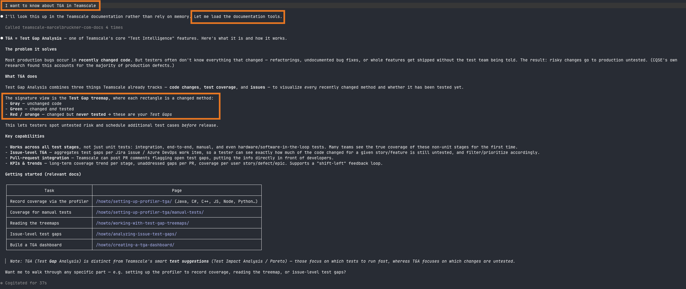

---

<!-- _header: "A real session: TGA + frontend profiling · 2. pull the number (first try)" -->
<!-- _class: diagram -->

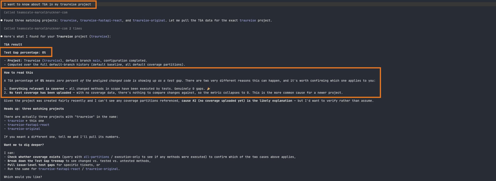

---

<!-- _header: "A real session: TGA + frontend profiling · 3. catching the wrong read" -->
<!-- _class: diagram -->


---

<!-- _header: "A real session: TGA + frontend profiling · 4. localize the gap" -->
<!-- _class: diagram -->

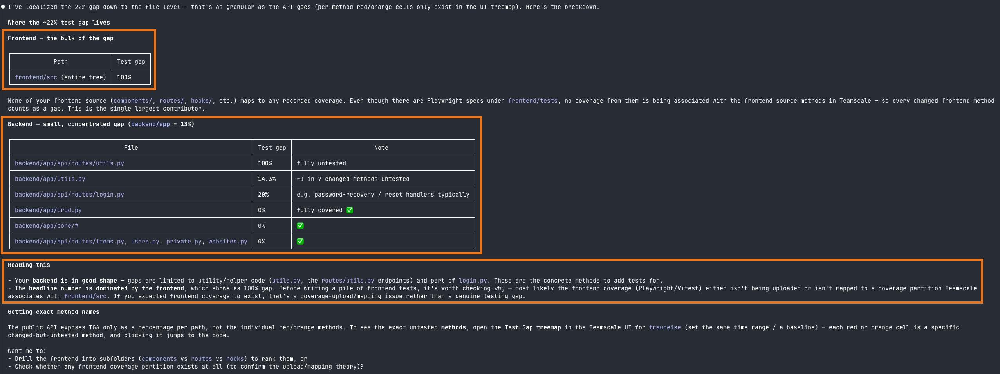

---

<!-- _header: "A real session: TGA + frontend profiling · 5. ask for a fix" -->
<!-- _class: diagram -->


---

<!-- _header: "A real session: TGA + frontend profiling · 6. the runbook (setup)" -->
<!-- _class: diagram -->

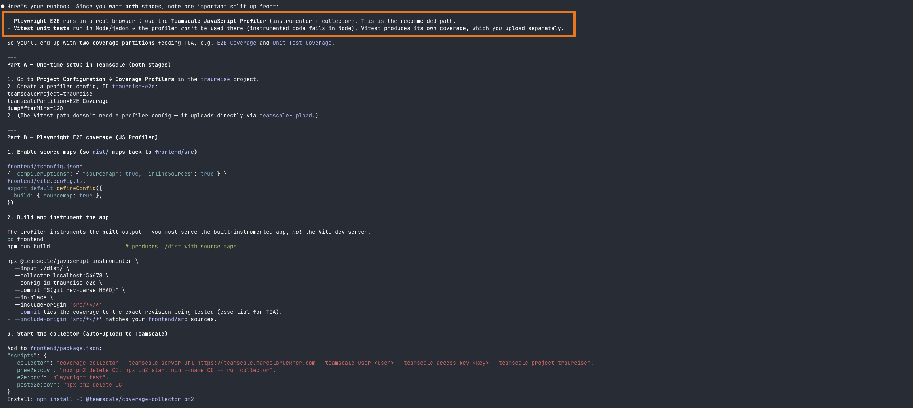

---

<!-- _header: "A real session: TGA + frontend profiling · 7. the runbook (run & verify)" -->
<!-- _class: diagram -->

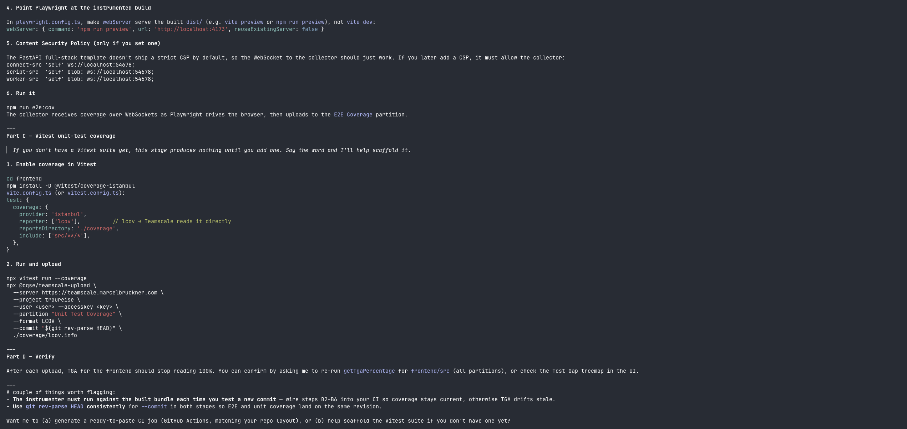

---

## The same pairing, on a tool outside either server

`teamscale-docs-mcp` also documents `teamscale-dev`.

<br>

> `teamscale-dev` itself stays out of scope for both servers, but *explaining* it doesn't.

---

<!-- _header: "The same pairing, on a tool outside either server" -->
<!-- _class: diagram -->

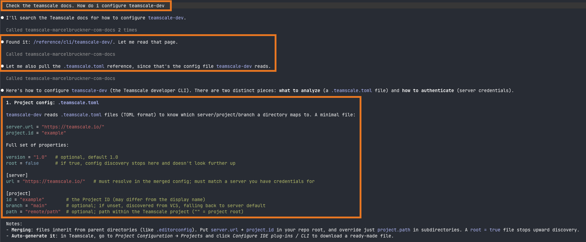

---

<!-- _header: "The same pairing, on a tool outside either server" -->
<!-- _class: diagram -->

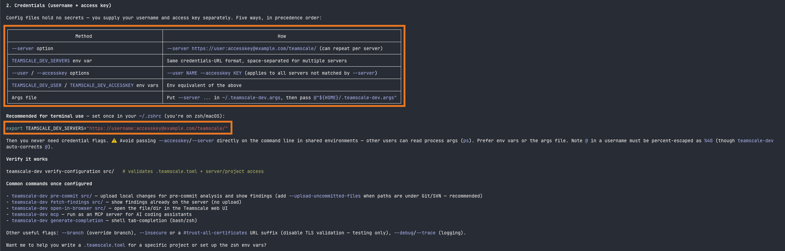

---

<!-- _header: "The same pairing, on a tool outside either server" -->
<!-- _class: diagram -->


---

## The honest ledger: **capability, not opinion**

<div class="split">
<div>

### ✅ Can

- Expose the **entire REST API** as tools
- Serve **any MCP client** (Claude Code, CI, web, cron)
- Authenticate as **any identity** (personal or service)
- **Explain and act** together (with docs-mcp)
- **Observability**: every call through one vantage point
- **Retrofit** old instances

</div>
<div>

### 🚫 Can't

- **No local working tree** → `local-*` stay on `teamscale-dev`
- **Raw tools, not workflows** → orchestration on the agent, so not the smoothest fix/PR loop

</div>
</div>

<br/>

> It's an addition, not a replacement for `ts_agent_helper`

---

<!-- _class: lead -->
<!-- _paginate: false -->

# Thank you

**teamscale-mcp** gives Teamscale to any agent and any identity.
**teamscale-docs-mcp** gives it the manual.


*Questions?*

---

<!-- _header: "" -->
<!-- _class: lead -->
<!-- _paginate: false -->

# Backup

---

## Configured entirely by **env vars**

```yaml
teamscale-mcp:
  
  image: registry.gitlab.com/cqse/internal/teamscale-mcp:latest
  ports: ["8081:8081"]                    # serving: MCP_HOST / _PORT / _PATH, MCP_ALLOWED_HOSTS
  environment:
    
    # Connection + bootstrap creds (used once, at startup, to fetch the spec)
    TEAMSCALE_SERVER_URL: http://teamscale:8080
    TEAMSCALE_SPEC_USER:  some-technical-user
    TEAMSCALE_SPEC_TOKEN: some-technical-user-api-token
    TEAMSCALE_INCLUDE_INTERNAL: "false"
    
    # Tool surface: trim to a sharp, read-oriented set (blocklist recommended)
    TEAMSCALE_EXCLUDE_TAGS: "Backup,System,Users,Profilers,SAP,…"
    TEAMSCALE_EXCLUDE_METHODS: "DELETE,PUT,PATCH"
    # TEAMSCALE_INCLUDE_TAGS:  "Findings,Metrics,Test Gap Analysis"
    # TEAMSCALE_INCLUDE_NAMES: "createBaseline"
```

<br>

> Per-request identity arrives in the `X-Teamscale-User` / `-Token` headers, never from the environment.

---

## Connect multiple clients with **one command each** 

Point any MCP client at the URL, presenting your own identity:

```bash
claude mcp add teamscale-cqse --scope user --transport http \
  https://cqse.teamscale.io/mcp \
  --header "X-Teamscale-User: bruckner@cqse.eu" \
  --header "X-Teamscale-Token: YOUR_API_TOKEN"
```

And add as many servers as you need:
```bash
claude mcp add teamscale-personal --scope user --transport http \
  https://teamscale.marcelbruckner.com/mcp \
  --header "X-Teamscale-User: marcel" \
  --header "X-Teamscale-Token: YOUR_API_TOKEN"
```

<br>

> The two headers *are* your Teamscale identity, forwarded per request.
> Any MCP-capable client works the same way.

---

## Configured by a single **env var**

```yaml
teamscale-docs-mcp:

  image: registry.gitlab.com/cqse/internal/teamscale-docs-mcp:latest
  ports: ["8082:8082"]                    # serving: MCP_HOST / _PORT / _PATH, MCP_ALLOWED_HOSTS
  environment:

    # The only real setting: where the docs live. Point at the instance's
    # version-matched bundled docs, so no request leaves the network …
    DOCS_BASE_URL: http://teamscale:8080/documentation
    
    # … or serve the public site instead:
    # DOCS_BASE_URL: https://docs.teamscale.com
```

<br>

> No credentials, no headers: the docs are public content, so there is nothing to authenticate.

---

<!-- _header: "A real session: TGA + frontend profiling" -->
<!-- _class: diagram -->


---

<!-- _header: "Plugin skills · today vs. the sidecar backend" -->
<!-- _class: lead -->
<!-- _paginate: false -->

# Plugin comparison

Each diagram: **today (`ts_agent_helper`)** on the left, **with `teamscale-mcp`** on the right.

---

<!-- _header: "check-setup — shifts to verifying the endpoint" -->
<!-- _class: diagram -->

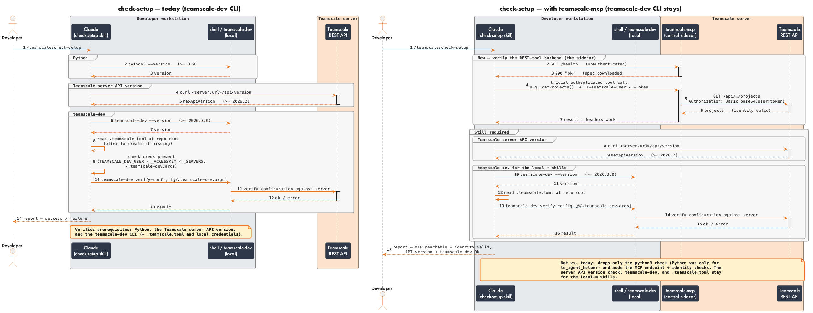

---

<!-- _header: "local-fix-findings — stays local" -->
<!-- _class: diagram -->

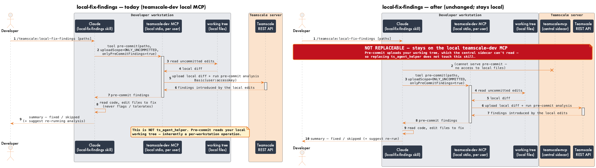

---

<!-- _header: "local-select-tests — stays local" -->
<!-- _class: diagram -->

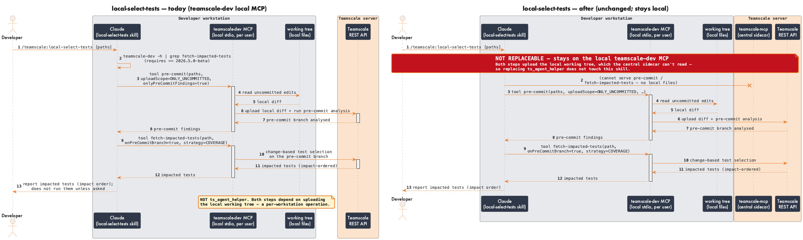

---

<!-- _header: "fix-findings — replaceable (clean win)" -->
<!-- _class: diagram -->

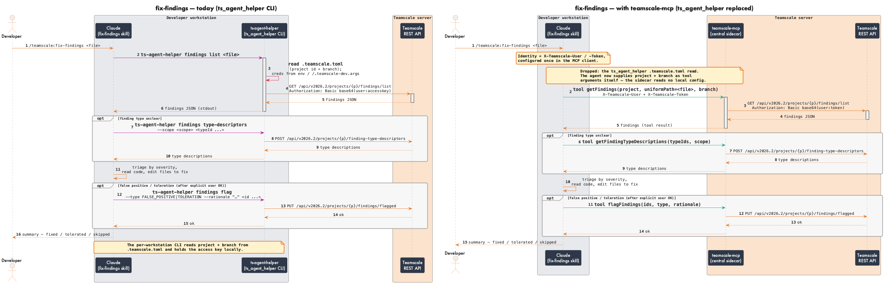

---

<!-- _header: "pr-fix-findings — replaceable (agent takes over PR resolution)" -->
<!-- _class: diagram -->

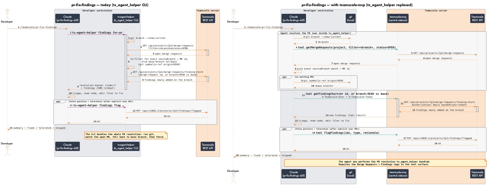

---

<!-- _header: "pr-close-test-gaps — replaceable (agent takes over PR resolution)" -->
<!-- _class: diagram -->

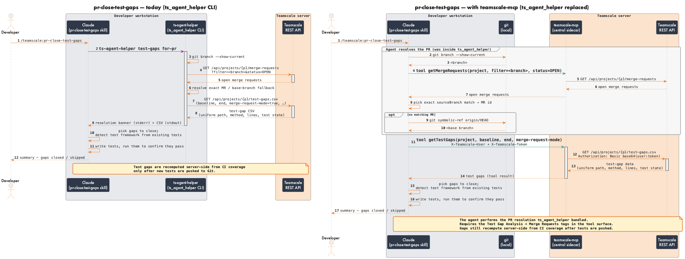
